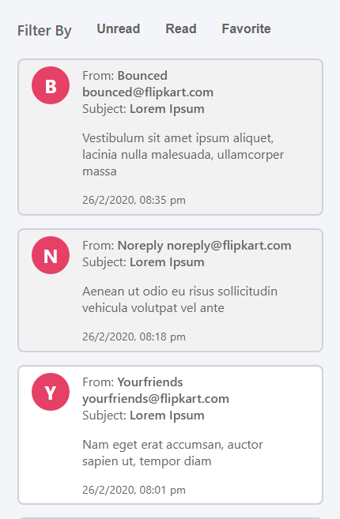
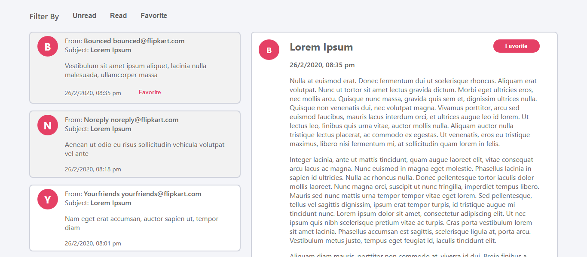
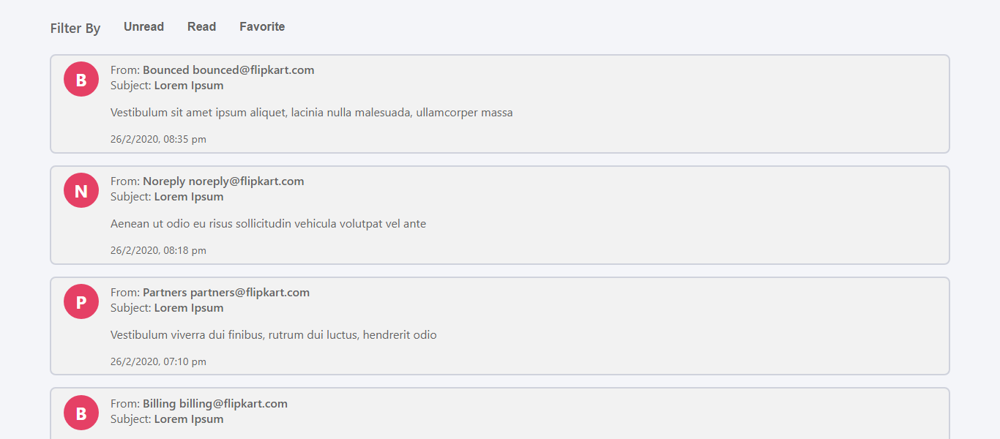
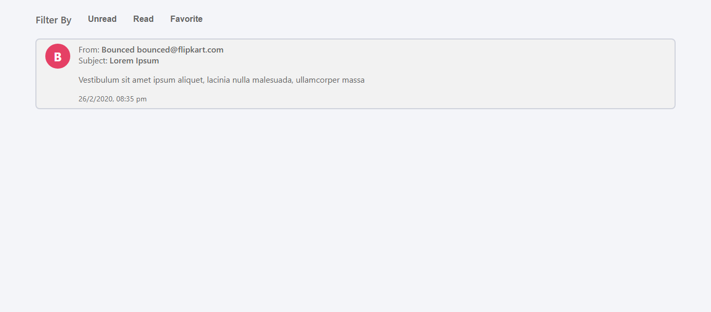

# FlixMail

#### A ReactJS web app for mails

## Demo

[Deployed on Netlify using github actions](https://debarshib-flixmail.netlify.app/)

## Features:

- List of all mails
- Individual mail data on click
- Filter Read/Unread/Favorite mails
- Auto marking of mail as read
- Mark mail as favorite
- Persistance of read and favorite mails through localStorage
- Clear UI to differentiate between read, undread & favorite messages
- ErrorBoundary to handle UI error and show fallback UI

## Built using:

- [ReactJS](https://reactjs.org/) - Frontend framework
- [DomPurify](https://www.npmjs.com/package/dompurify) - To sanitize dangerous HTML
- [Classnames](https://www.npmjs.com/package/classnames) - To handle conditional styles effectively
- [PropTypes](https://www.npmjs.com/package/prop-types) - Runtime type checking for React props and similar objects

## Screenshots

<div align="center">









</div>

## Run Locally

- Clone the project
  ```
  git clone https://github.com/Debarshi95/FlixMail.git
  ```
- Go to the project directory
- cd **flixmail**
- Install dependencies
  ```
  yarn
  ```
- Create a **.env** file
- Add the following configuration to your .env file

  ```
  REACT_APP_FLIX_API="<FLIX_API_URL>"
  ```

- Start the server
  ```
  yarn start
  ```
